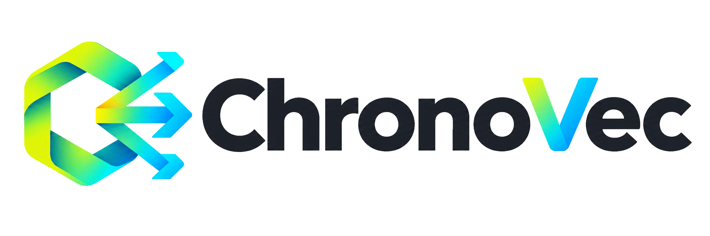

<div align="center">

<picture>
  <source media="(prefers-color-scheme: dark)" srcset="assets/chronovec-logo-lockup.png">
  
</picture>

**Vector memory for data that changes**

[](https://github.com/mchl-labs/chronovec/actions/workflows/ci.yml)
[](https://pypi.org/project/chronovec/)
[](https://www.npmjs.com/package/@chronovec/native)
[](https://crates.io/crates/chronovec)
[](LICENSE)

[Documentation](https://mchl-labs.github.io/chronovec/) · [Getting Started](docs/getting-started.md) · [API Reference](docs/api-reference.md) · [Architecture](docs/architecture.md) · [Examples](examples/)

</div>

---

Most vector libraries optimize for a static corpus. Real systems do not stay still: agents write memories continuously, documents get corrected, users invoke the right to erasure, and teams need to reproduce what a retriever saw last Tuesday.

ChronoVec is an approximate-nearest-neighbour index built for that case. Every record carries a version interval, so queries can read the index as of any past moment, deletions physically reclaim space on a bounded budget, and continuous writes never force a rebuild or block a reader.

```bash
pip install chronovec
```

The same native core is available through the other mainstream package
managers too:

```bash
cargo add chronovec
npm install @chronovec/native
```

> Building from source requires a C++20 compiler and CMake (`pip install .` handles that automatically). See [Getting started](docs/getting-started.md) for full instructions.

Portable builds use baseline CPU instructions. If every deployment CPU supports
AVX2, opt in with `-DCHRONOVEC_ENABLE_AVX2=ON` for faster x86 distance kernels.

---

## Why ChronoVec exists

### 1. Query the past

```python
t1 = index.insert(1, embedding)
index.delete(1)

index.search(query, k=10)               # now: id 1 is gone
index.search(query, k=10, snapshot=t1)  # as of t1: id 1 is there
```

Audit, reproducible evaluation, and retrieval regression debugging all need this. ChronoVec makes the snapshot part of the retrieval API.

### 2. Delete for real, on a budget

```python
index.delete(user_vector_id)
index.vacuum(oldest_snapshot=index.clock + 1, budget_versions=64)
```

`vacuum` physically reclaims at most `budget_versions` expired records: no full rebuild. For compliance workflows, logical deletion is immediate and physical reclamation is explicit and bounded.

### 3. Write continuously without blocking readers

Writes never block reads. A reader snapshots an immutable view and queries it lock-free, even while a batch is in progress. Reads and writes compose: insert, delete, and query concurrently from multiple threads with no coordination at the reader.

### 4. Branch and speculate

```python
from chronovec import AgentMemory

memory = AgentMemory(384)
memory.add(1, embedding, text="base knowledge")

plan = memory.branch("hypothesis")
plan.add(2, other, text="speculative, not yet committed")
plan.search(query)    # sees base + speculation
memory.search(query)  # main never saw the speculation
plan.discard()        # abandon speculation; purge later
```

Agent memory with snapshot isolation: spawn a branch, explore speculatively, discard or merge. Each branch gets its own private delta index by default, so there's no fixed branch-count ceiling.

### 5. Survive a crash

```python
index = Index(768, wal_path="index.wal")
index.insert_many(ids, vectors)
# process dies here
index = Index(768, wal_path="index.wal")  # replays the log; nothing lost
```

Writes are logged before they are applied. A torn tail from a crash mid-append is detected by CRC, dropped, and the file truncated cleanly.

---

## Quick start

### Quickstart

```python
from chronovec import Collection

# In-memory collection, for easy prototyping. Add persistence easily below!
collection = Collection(dimensions=3)

# Add records in batches; update() and delete() use the same ids-oriented API.
collection.add(
    ids=["doc1", "doc2"],   # unique per record
    embeddings=[[1, 0, 0], [0, 1, 0]],  # or pass embedding_function= and add documents only
    documents=["This is document1", "This is document2"],
    metadatas=[{"source": "notion"}, {"source": "google-docs"}],  # filter on these!
)

# Query the 2 most similar results. get() fetches by id/filter without a search.
results = collection.query(
    [1, 0, 0],
    k=2,
    # where={"source": "notion"},   # optional metadata filter
    # snapshot=collection.snapshot(),  # optional: read as of an earlier point in time
)
```

For text embedding, pass either the original batch callable or ChronoVec's
provider-neutral adapter. The adapter keeps document and query embedding
separate when your model needs different instructions:

```python
from chronovec import Collection, CustomEmbedding

embedder = CustomEmbedding(
    embed_documents=my_embed_documents,  # list[str] -> list[list[float]]
    embed_query=my_embed_query,           # str -> list[float]
)
collection = Collection(dimensions=384, embedding_function=embedder)
collection.add(ids=["doc1"], documents=["This is document1"])
results = collection.query(query_text="find document one", k=1)
```

Objects exposing `embed_documents` and `embed_query` are accepted directly,
as are LlamaIndex-style `get_text_embedding_batch` and
`get_query_embedding` objects. ChronoVec does not install or select a model
provider; use the provider library that fits your application.

For local Sentence Transformers models, install the optional adapter:

```bash
pip install "chronovec[sentence-transformers]"
```

```python
from chronovec import Collection, SentenceTransformerEmbedding

embedding = SentenceTransformerEmbedding("sentence-transformers/all-MiniLM-L6-v2")
collection = Collection(384, embedding_function=embedding)
```

For hosted providers, ChronoVec wraps [LiteLLM](https://docs.litellm.ai/) so one
adapter covers OpenAI, Cohere, Bedrock, Azure, and the rest of LiteLLM's
provider list without ChronoVec depending on any of them directly:

```bash
pip install "chronovec[litellm]"
```

Pass the provider secret explicitly from your environment:

```python
import os

from chronovec import Collection, ProviderEmbedding

embedding = ProviderEmbedding(
    provider="openai",
    model="text-embedding-3-small",
    api_key=os.environ["OPENAI_API_KEY"],
)
collection = Collection(1536, embedding_function=embedding)
```

Add persistence with a `Client`, which opens (or creates) named collections
that checkpoint themselves to disk after every mutation, no separate save
call:

```python
from chronovec import Client

client = Client("./data")  # omit the path for "./.chronovec"

# get_collection, list_collections, delete_collection also available!
collection = client.get_or_create_collection("docs", dimensions=3)
collection.add(ids=["doc1"], embeddings=[[1, 0, 0]], documents=["This is document1"])
```

Inspect a persistent store with `chronovec list ./data` or `chronovec
inspect ./data docs`.

```bash
# Install from source: cmake runs automatically
pip install ".[dev]"
```

```python
from chronovec import Index, Collection

# Low-level API: int64 ids, NumPy vectors
index = Index(384, metric="cosine", page_capacity=256, nprobe=16)
t1 = index.insert(1, embedding)
index.insert(2, other_embedding)

for hit in index.search(query, k=10):
    print(hit.id, hit.distance)

index.delete(1)
index.vacuum(oldest_snapshot=index.clock + 1, budget_versions=64)
index.save("memories.cvec")
restored = Index.load("memories.cvec")

# High-level API: string ids, metadata, rich filtering
memory = Collection(dimensions=768, metric="cosine")
memory.add(ids=["doc-a"], embeddings=[v], metadatas=[{"lang": "en", "score": 0.9}])

before = memory.snapshot()
memory.add(ids=["doc-a"], embeddings=[corrected])

memory.query(q, k=5, where={"lang": "en"})                  # latest
memory.query(q, k=5, where={"lang": "en"}, snapshot=before) # as of `before`
```

`where` supports `$eq $ne $gt $gte $lt $lte $in $nin $contains $regex $and $or`.

```python
# Async API for FastAPI / asyncio: same shape as Collection, awaited
from chronovec import AsyncCollection

memory = AsyncCollection(768, embedding_function=my_embed)
await memory.add(ids=["doc-a"], documents=["the user prefers dark mode"])
results = await memory.query(query_text="appearance settings", k=5)
```

---

## Framework integrations

| Integration | Import | Notes |
|---|---|---|
| **LangChain** | `chronovec.integrations.langchain.ChronoVecVectorStore` | Full `VectorStore` subclass with branching for LCEL chains |
| **LlamaIndex** | `chronovec.integrations.llamaindex.ChronoVecLlamaStore` | Node storage contract, metadata filtering |
| **LangGraph** | `chronovec.integrations.langgraph.LangGraphMemory` | Maps one graph `thread_id` to one isolated ChronoVec branch |
| **DuckDB** | `chronovec.duckdb_adapter.ChronoDuckDBAdapter` | SQL UDF interface (experimental) |
| **SQLite** | native virtual table | Embedded, durable via SQLite WAL |
| **Rust** | `bindings/rust/chronovec` | Raw `Index` tier plus an ergonomic `collection::Collection` (string ids, metadata, filters: same vocabulary as Python's `Collection`) |
| **Go** | `bindings/go/chronovec` | Raw `Index` tier via cgo, plus an ergonomic `Collection` (`any`-typed ids, `map[string]any` metadata, `where=`-style filter maps) built from scratch, no Rust crate for Go to reuse |
| **Node.js** | `bindings/node` (`@chronovec/native`) | Raw `Index` tier plus an ergonomic `Collection` (string ids, metadata, filter DSL as plain `where=` objects), via napi-rs wrapping the Rust crate. ids are `bigint` (JS `number` can't hold the full id range losslessly) |

```python
# LangChain: branching LCEL chains
from chronovec.integrations.langchain import ChronoVecVectorStore

store = ChronoVecVectorStore(embedding=embeddings, dimensions=384)
store.add_texts(["the user prefers dark mode"])

with store.branch("hypothesis") as scratch:
    scratch.add_texts(["speculative memory"])
    scratch.similarity_search("theme")  # sees both
store.similarity_search("theme")         # speculation discarded
```

```python
# LlamaIndex
from chronovec.integrations.llamaindex import ChronoVecLlamaStore

store = ChronoVecLlamaStore(dimensions=768)
index = VectorStoreIndex.from_vector_store(store)
```

---

## Language support

| Language | Status |
|---|---|
| C / C++ | Native library and stable C ABI (`bindings/rust/chronovec-sys/native/include/chronovec.h`) |
| Python | Stable: `Client`/`Collection` for applications, `Index` for low-level control |
| Rust | Supported alpha: `cargo add chronovec`; the native core builds from the crate |
| Go | Supported alpha: `github.com/mchl-labs/chronovec/bindings/go/chronovec` via cgo |
| Node.js | Supported alpha: `npm install @chronovec/native`, with prebuilt platform binaries |
| SQLite | Integration: loadable virtual table and static-registration library |

See the [support and maturity matrix](docs/support-matrix.md) for the exact
compatibility and guarantee boundary.

---

## Performance

Measured fresh against chromadb, faiss-ivfflat, and hnswlib on SIFT-128, GloVe-25, and GIST-960, up to 500,000 live vectors: ChronoVec leads on the workload it's built for, and the margin grows with scale rather than shrinking:

- **Write-heavy workloads:** chronovec holds ~140-150k replacement-pairs/s at high recall across every churn epoch tested at 200k live vectors: 16.5x faiss's steady-state throughput at that scale (vs. 2x at 10k; faiss's `remove_ids` cost compounds with corpus size). hnswlib stays roughly 70x below chronovec throughout, and chroma didn't complete this workload above 10,000 live vectors: three independent attempts at 50k/100k/200k all exceeded their 5-24 minute time budgets.
- **Concurrent reads during writes:** chronovec is the only one of the four that's both provably safe (snapshot isolation) and fast: hnswlib and faiss don't document concurrent read+write as safe at all, and chroma is safe but ~980x slower at p99 at 200,000 live vectors.
- **Metadata-filtered search:** chronovec's page-skipping gets faster as the filter tightens, an advantage that holds from 50k through 500k live vectors; hnswlib gets up to 100x slower at tight filters, and faiss's post-filter approach is fast but falls short of its recall target by up to 80 points and, at scale, stops returning k results for the majority of queries.

For a corpus that's built once and never mutated afterward, hnswlib and faiss both out-query chronovec by ~1.5-2x at matched recall on SIFT-128/GloVe-25 (that's the price of the versioning machinery above), and if your index never changes, either is a fine choice. ChronoVec overtakes hnswlib again at 960 dimensions. ChronoVec is for the other workload: agents writing memories, RAG corpora receiving corrections, CDC streams, and systems that need deletion, historical replay, or filtered queries against a corpus that keeps changing.

See [docs/performance.md](docs/performance.md) for full numbers, methodology, and the regression gate protocol.

The public comparison suite is reproducible from a clean checkout: install the
benchmark extra, fetch the named ANN-Benchmarks files, then run
`benchmarks/run_all.sh`. The command writes machine-readable JSON results and
skips only engines that are not installed; see [the benchmark instructions](docs/performance.md).

---

## Examples

| Example | What it shows |
|---|---|
| [`examples/agent_memory.py`](examples/agent_memory.py) | Branching, speculation, time travel, vacuum |
| [`examples/langgraph_branching_memory.py`](examples/langgraph_branching_memory.py) | LangGraph-style trajectory evaluation with isolated ChronoVec memory branches |
| [`examples/lats_chronovec.py`](examples/lats_chronovec.py) | Persistent-delta LATS tree search with 85 live isolated trajectories and atomic publish |
| [`examples/lats_benchmark.py`](examples/lats_benchmark.py) | LATS at scale: configurable depth/branching-factor, async concurrent rollouts, checkpoint/resume, and a benchmark against a copy-per-trajectory baseline |
| [`examples/rag_time_travel.py`](examples/rag_time_travel.py) | Query corpus as of t-1 after an update |
| [`examples/streaming_updates.py`](examples/streaming_updates.py) | High-churn loop: insert/delete/vacuum, amplification stays flat |
| [`examples/compliance_deletion.py`](examples/compliance_deletion.py) | GDPR erasure: delete + vacuum + verify gone at any snapshot |

---

## Flagship demo: agent memory

Run the offline demo (no model key, database, or service required):

```bash
pip install chronovec
python examples/agent_memory.py
```

It captures an interaction, retries a mistaken memory update on an isolated
branch, and merges the corrected result without contaminating the original
timeline. For the broader mutable-RAG workflow, see
[`examples/mutable_rag.py`](examples/mutable_rag.py).

## Documentation

| | |
|---|---|
| [Getting started](docs/getting-started.md) | Install, build, 3-minute tour |
| [Migrating from Chroma](docs/migration-from-chroma.md) | Familiar API, snapshots, branching, and deletion semantics |
| [Architecture](docs/architecture.md) | MVCC, page structure, routing, reclamation |
| [API reference](docs/api-reference.md) | All public classes and methods |
| [Integrations](docs/integrations/) | LangChain, LlamaIndex, DuckDB, SQLite, Rust |
| [Use cases](docs/use-cases/) | Agent memory, RAG with history, compliance, streaming |
| [Performance](docs/performance.md) | Benchmarks, methodology, regression gates |
| [Contributing](CONTRIBUTING.md) | Build from source, conventions, how to add tests |

### Using ChronoVec from a coding agent

If you are building or modifying code that uses ChronoVec inside [Claude Code](https://claude.ai/code), a skill file is included that teaches the agent the API idioms, snapshot timing, branching patterns, and common footguns. It activates automatically when relevant. The skill lives at [`.claude/skills/chronovec/chronovec/SKILL.md`](.claude/skills/chronovec/chronovec/SKILL.md) and can be invoked explicitly with `/chronovec`.

## Citing ChronoVec

If ChronoVec contributes to your research or publication, please cite it:

```bibtex
@software{chronovec,
  title  = {ChronoVec: A Versioned Vector Index with Snapshot Isolation},
  author = {Rottoli, Michael},
  year   = {2026},
  url    = {https://github.com/mchl-labs/chronovec},
  license = {Apache-2.0}
}
```

The repository also includes a machine-readable
[`CITATION.cff`](CITATION.cff) file.

---

## Status

- **Solid:** MVCC correctness, bounded reclamation, lock-free reads, checkpoint save/load, sanitizer targets (ASan/UBSan/TSan), C-ABI fuzzing, comprehensive test suite (3,700+ lines).
- **Stable:** The Python API and C ABI are production-supported. Writers serialize on a single MVCC lock (lock-free reads, not multiwriter mutation).
- **Supported alpha:** Rust, Go, and Node.js bindings have release CI but do not yet carry the Python API's compatibility promise.
- **Experimental:** DuckDB adapter (not thread-safe, minimal test coverage), SQLite dqlite failover.
- **Async:** `AsyncCollection` is available for asyncio/FastAPI applications; the low-level `Index` can be called through `asyncio.to_thread()` when needed.
